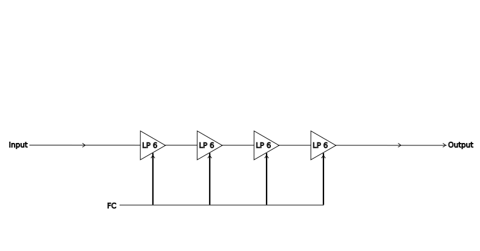
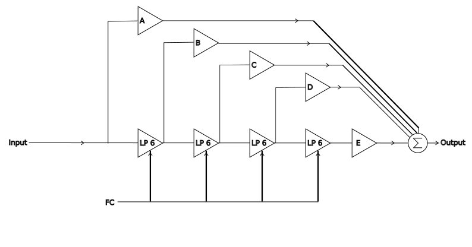
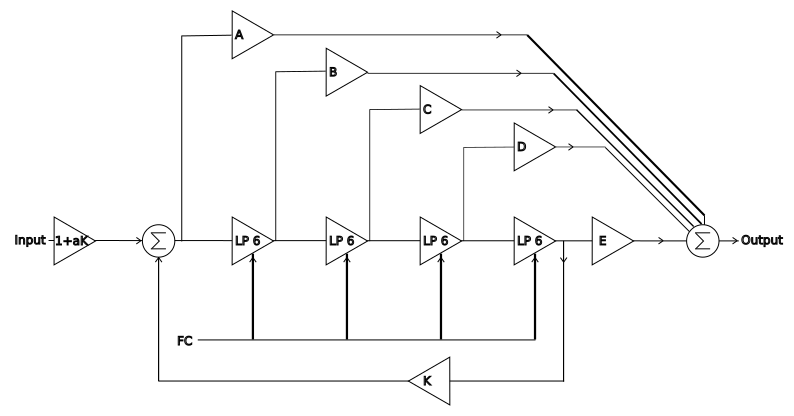
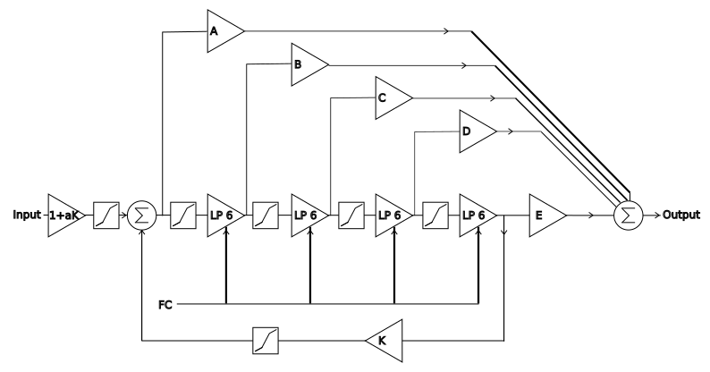
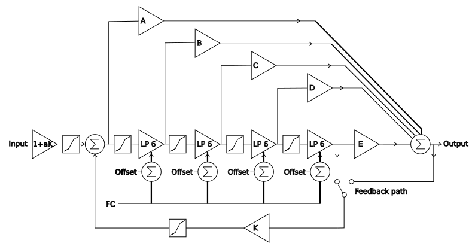

# Ladder Filter Designer

## Introduction

Over the past few year I have implemented a few multimode ladder filters in both 
software and hardware, each time I have learned something, and wished I had included 
that knowledge in previous designs. Recently I have been building a Diy modular synth 
where I have discovered the joys of both non linear signal paths, and the variations
caused by the component tolerances, no two builds of my filter have sounded the same.

## How multimode pole mixing ladder filters work

There are many ways to implement a filter, but the method I use and first discovered
while reading "Designing Software Synthesizers" is a ladder filter, where the outputs
of each stage are summed with varying weights. Each pole of a ladder filter is a 6dB 
lowpass filter.

The multimode is achieved because it is possible to sum the stages. The following
image, simply shows the process.

A simple ladder filter can be constructed by following the diagram, not fc, the cutoff frequency 
needs to be set on each stage.

The pole mixing can be added by scaling each stage, and summing as the output

Resonance can be added with a feedback loop, the inverted feedback is summed with the input.

## Non linear 

The above image will give a very clean filter, and is used in the Maccomo module,
commonly some warmth or character is required. Hardware implementations address 
this issue with non-linear distortion, both naturally occurring in the filter stages
 and added by design in the initial drive stage, and in the resonance feedback loop. 
My intention is to implement this, both using mathematical wave-shaping functions, 
and using lookup tables, sampled from hardware. As wave-shaping adds harmonics, in the
digital domain we must respect the Nyquist theorem, so oversampling may be required, 
this will be provided as a parameter.

The last couple of features I would like to include are independent offset to the cutoff 
frequency for each stage, and an alternate feedback path, as I implemented in a hardware DIY
module.

## Tolerances in electronic implementations 

One of the many thing I learned while building a DIY modular, no two units sound identical. 
Electronic components are all manufactured to a tolerance, modern film resistors are 1%, 
Mica capacitors used to set the FC are 5%, with other capacitors 20%. I am intending to add 
randomised offsets to all parameters on a per instance basis. 

## VCV Rack modules(s)

The intention is to have two user interfaces, a filter design interface, with a parameters 
accessable, and a smaller interface with just the required elements for music production. I am
yet to decided how to implement this, maybe two modules, that can share parameters via presets, 
or a module with two interfaces. A final thought, is a pop out interface. This shall require more investigation.

## References, additional reading

Designing Software Synthesizer Plug-ins in C++, Pirkle, 2015, https://www.amazon.co.uk/Designing-Software-Synthesizer-Plug-Ins-RackAFX/dp/1138406449

Designing Audio Effect Plugins in C++, Pirkle, 2019, https://www.amazon.co.uk/Designing-Audio-Effect-Plugins-Theory/dp/1138591939/

Multimode filters, Part 1: Reconfigurable filters  https://electricdruid.net/multimode-filters-part-1-reconfigurable-filters/

