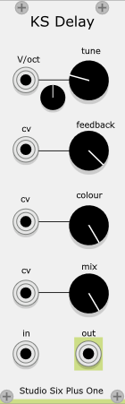

# StudioSixPlusOne
VCV Rack modules

A collection of modules for [VCV Rack](https://github.com/VCVRack/Rack), a cross platform opensource, modular synth emulator software.

Modules are polyphonic where applicable. Early releases and beta modules can be found here on github, before being submitted to the VCV libary.

## Building from code

[VCV Rack source](https://github.com/VCVRack/Rack) is required. In the Rack build directory switch to 'plugins/' and

```
  git clone https://github.com/curlymorphic/StudioSixPlusOne.git
  cd StudioSixPlusOne
  make
  ```
  
  New modules prior to release, may be in seperate branches, instruction will be given during testing.
  
 ## Modules
 
 ### KS Delay
 
 
 
 A delay plugin designed for use when using [Karplus–Strong string synthesis](https://en.wikipedia.org/wiki/Karplus%E2%80%93Strong_string_synthesis) featuring:
 
 - Delay time tuned to pitch, via the V/oct input and the two tune knobs, Octave selector and fine tune in semitones
 - Feedback control, focusing on the area required for the string delay
 - Low Pass filter, to change the tone
 - Mix, to allow the blending of the noise impulse with the resulting string sound. I think of this like changing plectrum.
 - Polyphonic, the number of channels is defined by the audio input.
 
 The main audio input should be triggered with noise, the color and duration of this has a large impact on the resulting sound. Try experimenting with short bursts, such as snare sounds, longer noise sounds with automated frequency can be used to emulate a bowed sound.
 

### Maccomo


An emulation of a Moog ladder filter, based on the descriptions and block diagrams in Will Pirkles book "Designing software synthesizers plugins in c++" featuring

- Six modes, selectable via CV and the knob, allowing for automatiom between lp12, lp24, hp12, hp24, bp12 and bp24
- Frequency contols are summed, for accurate pitch tracking set the knob to C4 261Hz and use the V/oct input
- Resonance that allows for self oscillation
- Saturation to add colour and dirt to the sound
- Polyphonic, the number of channels is defined by the audio input.

If the audio input is disconnected, the filter will still run in monophonic mode, allowing for self oscillation and use as a VCO


