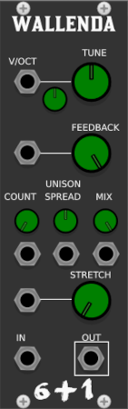
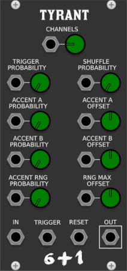
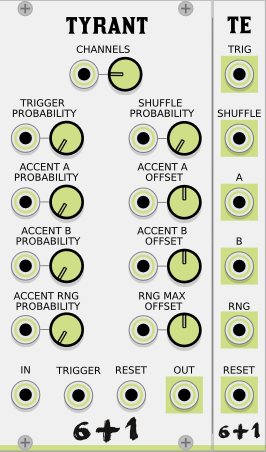
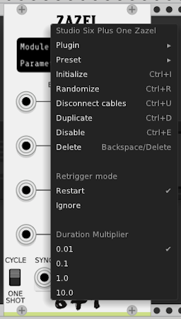
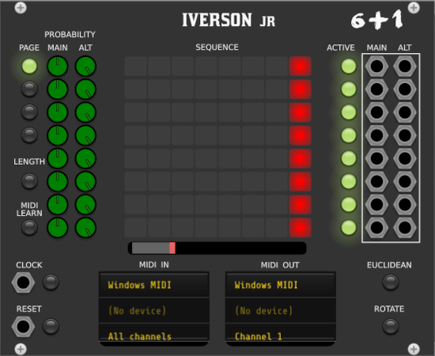

# StudioSixPlusOne
VCV Rack modules

A collection of modules for [VCV Rack](https://github.com/VCVRack/Rack), a cross platform opensource, modular synth emulator software.

Modules are polyphonic where applicable. Early releases and beta modules can be found here on github, before being submitted to the VCV library.

## Building from code

Instructions can be found in the VCV manual https://vcvrack.com/manual/Building#building-rack-plugins
  
 ## Modules
 
 [Wallenda](#wallenda)
 
 [Maccomo](#maccomo)

 [Massarti](#massarti)
 
 [Tyrant](#tyrant)

 [TE](#te) Tyrant expander

 [Lala](#lala)
 
 [Eva](#eva)
 
 [Zazel](#zazel)
 
 [Iverson](#iverson)
 

  

 ### Wallenda
 
  

 A delay plugin designed for use when using [Karplus–Strong string synthesis](https://en.wikipedia.org/wiki/Karplus%E2%80%93Strong_string_synthesis) featuring:
 
 - Delay time tuned to pitch, via the V/oct input and the two tune knobs, Octave selector and fine tune in semitones
 - Feedback control, focusing on the area required for the string delay
 - Seven voice unison per polyphonic channel
 - Stretch, the nature of strings gives a natural decay, this controls the length
 - Polyphonic, the number of channels is defined by the audio input
 
 The main audio input should be triggered with noise, the color and duration of this has a large impact on the resulting sound. Try experimenting with short bursts, such as snare sounds, longer noise sounds with automated frequency can be used to emulate a bowed sound. All variations of sound input can be used to create sounds. 

[Omri's YouTube Tutorial](https://www.youtube.com/watch?v=VKX3ii-kR1Y)
 
 
 
 
 
 
 

### Maccomo  

 

An emulation of a ladder filter, based on the descriptions and block diagrams in Will Pirkles book "Designing Software Synthesizers Plugins in C++" featuring:

- Six modes, selectable via CV and the knob, allowing for automatiom between lp12, lp24, hp12, hp24, bp12 and bp24
- Frequency controls are summed, for accurate pitch tracking set the knob to C4 261Hz and use the V/oct input
- Resonance that allows for self oscillation
- Drive to add colour and dirt to the sound, works well when self oscillating
- Polyphonic, the number of channels is defined by the audio input or the V/oct input for use as an oscillator

If the audio input is disconnected, the filter will still run in monophonic mode or with the channel count of the V/oct input, allowing for self oscillation and use as a VCO.

 
 
 
 
 
 

### Massarti

 

A feedforward comb filter with added feedback loop, can be used to create pitched sounds from noise, or for the adding of overtones

- Frequency controls are summed, for accurate pitch tracking
- Comb control adjusts the magnitude of the harmonic bands, positive values boost, negative values cut
- Feedback adds warmth, and reverb like effect
- Polyphonic, the number of channels is defined by the audio input

 
 
 
 
 
 
 
 
 
 
 

### Tyrant

A monophonic in, polyphonic out shift register, with many probability options.

- Variable number of polyphonic channels for 1 - 16
- Trigger Probability controls the chance of triggers being skipped
- Shuffle Probability controls the values in the buffer being reordered
- Three accent controls
- Accent A & B apply a fixed offset, Accent RNG applies a random offset with the maximum value defined by the offset controls
- If any of the probability CV's have no input or a monophonic input all channels are affected simultaneously, If the probability cv inputs have polyphonic inputs the channels are effected independently
- The Reset input sets the current channel count to 1 and samples the input, the channel count is increased on each trigger input, until the desired channel count is reached

 
 
 

[Omri's YouTube Tutorial](https://www.youtube.com/watch?v=hOjkkmr0oNs)
 
 

### Te
Tyrant Expander

An expansion module when placed to the right of Tyrant, provides trigger outputs for the probability actions provided by tyrant.

- all outputs polyphonic 
- pairs well with polyphonic envelope generator
- must be placed to the right and touching Tyrant

 
 
 

 
 
 

 
 
 

 
 
 

### Lala

A cascadable two way crossover, used for splitting audio frequency bands, for multiband processing

- Polyphonic
- Frequency controls the band ranges
- Summed output has a flat frequency response
- Can be cascaded for any number of bands
- Demo project for ideas <a href="patches//Lala_Demo.vcv">Demo patch</a>

 
 
 

 
 
 

 
 
 

 
 
 

### Zazel

A performance-based controller, designed to be connected to midi triggers, to allow smooth fades using easing functions between parameters on other modules, pairs well with VCV MIDI-Gate.

- Parameter select widget, display the module and parameter currently controlled, left-click then click on the desired parameter to assign and adjust to set the end parameter, right-click to unassign
- Curve display. Shows the currently selected easing, and form depending on one-shot or cycle mode
- Easing shape, the full selection of Robert Penner's Easing Functions
- Start value, sets one extreme of the parameter value
- End value, sets the other extreme of the parameter value
- Duration, the time taken to automate the parameter from the start to the end value. see Clock below
- Cycle - Oneshot, when in cycle mode the selected parameter is always translating from start to end value and back. when in Oneshot mode, a positive trigger at the "start" input automates the selected parameter from the start to end value, a negative-going trigger will reverse the automation
- Sync, the clock signal provides the time multiplier used by the duration control, if no input is provided the duration is multiplied by 1 second, this range can be adjusted in the context menu.
- Triggger, this is the trigger input used in one-shot mode
- Pause, this is a pause control
- Out CV output reflecting the controlled parameter
- Sync, Trig and Pause inputs, have a small grey tab below the input that can be used as buttons when connecting to MIDI-CAT
- retrigger mode selectable in context menu

### Eva

A slimline mixer for audio and cv.

- All inputs and outputs polyphonic
- CV controllable attenuverter

 
 
 

 
 
 

 
 
 

 
 
 
 
 
 

### Iverson

A performance based trigger sequencer with integrated support for midi grid controllers.

Iverson comes in two versions, a 16 step and an 8 step UI, for use depending on controller configuration and desired use.

 - Eight individual tracks
 - Four pages per sequencer, giving a maximum of 64 steps for Iverson and 32 steps for Iverson Jr
 - All controls internally midi mappable, with factory presets in the right click menu for various controllers. User defined mappings can be set by clicking the midi learn button on the ui, then triggering the midi controller, followed by selecting the required UI element. The context menu provides options to clear single and all midi mappings. If you define a midi map for a controller not provided in the factory presets you may, if you desire, summit the module preset for including in future releases
 - Independent track lengths allowing for polyrhythms. Each length can be set by clicking the length button on the left of the ui and selecting the last step to be played on the sequencing grid
 - Per track active/mute controls
 - Each track has two outputs, Main follows the programmed pattern, Alt output is for steps not triggered by the pattern, this can be used for ghost hits, open closed hat patterns, and alternating voice triggers of a pattern when used in combination with envelope generators and VCA's, both tracks can be controlled with the probability controls.
 - Probability controls  
 
    - The main probability control is used for the programmed steps, with a value of one, the main output mirrors the programmed grid, with a value less than one this is the chance that the programmed step will be played, values greater then 1 and a chance that non programmed steps will be played on the main output
    - The Alt probability controls the chance that non programmed outputs and played on the alt output
    - These can be used in combination to perform fills
    - The context menu provides options for adding a zero deadzone to the probability controls, this is useful when using in combination with a midi controller removing the requirement for exact zero placements when requiring only the programmed steps to be played
  
 - The clock input is passed to the outputs on triggers steps, allowing varying width clock pulses to be used
 - The reset input can be used to sync all tracks to restart
 - The lower region of the ui contains Midi assignment controls, both the input and output require assigning. Iverson has provision for two controllers for the sixteen steps, while using Iverson Jr only a single grid controller is required
 - The factory presets for APC mini Iverson JR map the sequencer grid, the lower buttons map the page selection, loop length and reset, the faders are assigned to the main probability controls. 
 - The factory presets for the APC mini Iverson when used with dual controllers features the same as above, with additional sliders for the Alt probability controls.
