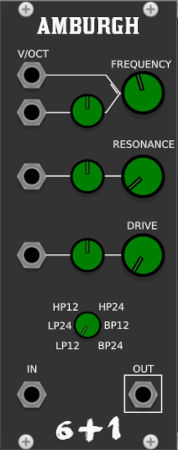
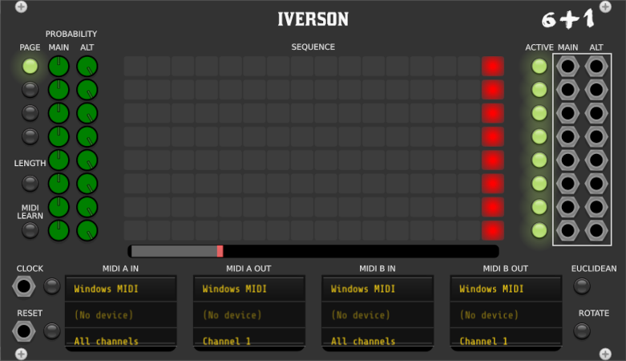
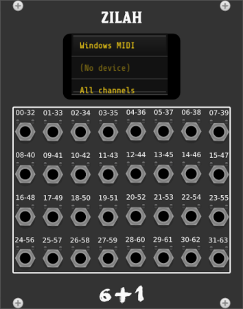
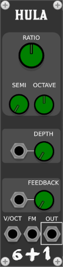
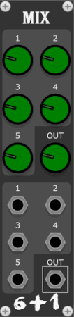
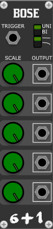

# StudioSixPlusOne

# Release  v2.1

A collection of modules for [VCV Rack](https://github.com/VCVRack/Rack), a cross platform opensource, modular synth
emulator software.

Modules are polyphonic where applicable. Early releases and beta modules can be found here on github, before being
submitted to the VCV library.

## Building from code

Instructions can be found in the VCV manual https://vcvrack.com/manual/Building#building-rack-plugins

## Modules

[Wallenda](#wallenda)

[Maccomo](#maccomo)

[Amburg](#amburg)

[Massarti](#massarti)

[Tyrant](#tyrant)

[TE](#te) Tyrant expander

[Lala](#lala)

[Eva](#eva)

[Zazel](#zazel)

[Iverson](#iverson)

[Zilah](#zilah)

[Hula](#hula)

[Bascom](#bascom)

[Bascom Expander](#bascomexpander)

[Mix](#Mix)

[Bose](#Bose)

[Duffy](#Duffy)

[Farini](#Farini)

[LalaStereo](#LalaStereo)

[Thru](#Thru)

[PatchNotes](#PatchNotes)

[Next](#next)

### Wallenda

  

A delay plugin designed for use when
using [Karplus–Strong string synthesis](https://en.wikipedia.org/wiki/Karplus%E2%80%93Strong_string_synthesis)
featuring:

- Delay time tuned to pitch, via the V/oct input and the two tune knobs, Octave selector and fine tune in semitones
- Feedback control, focusing on the area required for the string delay
- Seven voice unison per polyphonic channel
- Stretch, the nature of strings gives a natural decay, this controls the length
- Polyphonic, the number of channels is defined by the audio input

The main audio input should be triggered with noise, the color and duration of this has a large impact on the resulting
sound. Try experimenting with short bursts, such as snare sounds, longer noise sounds with automated frequency can be
used to emulate a bowed sound. All variations of sound input can be used to create sounds.

[Omri's YouTube Tutorial](https://www.youtube.com/watch?v=VKX3ii-kR1Y)
 
 

### Maccomo

 

An emulation of a ladder filter, based on the descriptions and block diagrams in Will Pirkles book "Designing Software
Synthesizers Plugins in C++" featuring:

- Six modes, selectable via CV and the knob, allowing for automatiom between lp12, lp24, hp12, hp24, bp12 and bp24
- Frequency controls are summed, for accurate pitch tracking set the knob to C4 261Hz and use the V/oct input
- Resonance that allows for self oscillation
- Drive to add colour and dirt to the sound, works well when self oscillating
- Polyphonic, the number of channels is defined by the audio input or the V/oct input for use as an oscillator

If the audio input is disconnected, the filter will still run in monophonic mode or with the channel count of the V/oct
input, allowing for self oscillation and use as a VCO.

 
 

### Amburg

Maccomo with some bite. The resonance response has been greatly improved,
and the drive control now really does drive.

### Massarti

 

A feedforward comb filter with added feedback loop, can be used to create pitched sounds from noise, or for the adding
of overtones

- Frequency controls are summed, for accurate pitch tracking
- Comb control adjusts the magnitude of the harmonic bands, positive values boost, negative values cut
- Feedback adds warmth, and reverb like effect
- Polyphonic, the number of channels is defined by the audio input

 
 

### Tyrant

A monophonic in, polyphonic out shift register, with many probability options.

- Variable number of polyphonic channels for 1 - 16
- Trigger Probability controls the chance of triggers being skipped
- Shuffle Probability controls the values in the buffer being reordered
- Three accent controls
- Accent A & B apply a fixed offset, Accent RNG applies a random offset with the maximum value defined by the offset
  controls
- If any of the probability CV's have no input or a monophonic input all channels are affected simultaneously, If the
  probability cv inputs have polyphonic inputs the channels are effected independently
- The Reset input sets the current channel count to 1 and samples the input, the channel count is increased on each
  trigger input, until the desired channel count is reached

 
 
 

[Omri's YouTube Tutorial](https://www.youtube.com/watch?v=hOjkkmr0oNs)
 
 

### Te

Tyrant Expander

An expansion module when placed to the right of Tyrant, provides trigger outputs for the probability actions provided by
tyrant.

- all outputs polyphonic
- pairs well with polyphonic envelope generator
- must be placed to the right and touching Tyrant

 
 

### Lala

 

A cascadable two way crossover, used for splitting audio frequency bands, for multiband processing

- Polyphonic
- Frequency controls the band ranges
- Summed output has a flat frequency response
- Can be cascaded for any number of bands
- Demo project for ideas <a href="patches//Lala_Demo.vcv">Demo patch</a>

 
 

### Zazel

A performance-based controller, designed to be connected to MIDI triggers, to allow smooth fades using easing functions
between parameters on other modules, pairs well with VCV MIDI-Gate.

- Parameter select widget, display the module and parameter currently controlled, left-click then click on the desired
  parameter to assign and adjust to set the end parameter, right-click to unassign
- Curve display. Shows the currently selected easing, and form depending on one-shot or cycle mode
- Easing shape, the full selection of Robert Penner's Easing Functions
- Start value, sets one extreme of the parameter value
- End value, sets the other extreme of the parameter value
- Duration, the time taken to automate the parameter from the start to the end value. see Clock below
- Cycle - Oneshot, when in cycle mode the selected parameter is always translating from start to end value and back.
  when in Oneshot mode, a positive trigger at the "start" input automates the selected parameter from the start to end
  value, a negative-going trigger will reverse the automation
- Sync, the clock signal provides the time multiplier used by the duration control, if no input is provided the duration
  is multiplied by 1 second, this range can be adjusted in the context menu.
- Triggger, this is the trigger input used in one-shot mode
- Pause, this is a pause control
- Out CV output reflecting the controlled parameter
- Sync, Trig and Pause inputs, have a small grey tab below the input that can be used as buttons when connecting to
  MIDI-CAT
- retrigger mode selectable in context menu

### Eva

A slimline mixer for audio and cv.

- All inputs and outputs polyphonic
- CV controllable attenuverter

 

### Iverson

A performance based trigger sequencer with integrated support for MIDI grid controllers.

Iverson comes in two versions: a 16 step and an 8 step (Iverson Jr).

- Eight individual tracks.
- Four pages per sequencer, giving a maximum of 64 steps for Iverson and 32
  steps for Iverson Jr
- All controls are internally MIDI mappable, with factory presets in the right
  click menu for various controllers. User defined mappings can be set by
  clicking the MIDI learn button on the UI, then triggering the MIDI controller,
  followed by selecting the required UI element. The context menu provides
  options to clear single and all MIDI mappings alongside changing the ordering of midi learn mode. If you define a MIDI
  map for a
  controller not provided in the factory presets you may, if you desire, submit
  the module preset for inclusion in a future Iverson release.
- Independent track lengths allowing for polyrhythms. Each length can be set by
  clicking the length button on the left of the UI and selecting the last step to
  be played on the sequencing grid.
- Per track active/mute controls.
- Each track has two outputs: Main and Alt. Main follows the programmed pattern.
  Alt output is for steps that are not triggered by the pattern, this can be used
  for ghost hits, open closed hat patterns, and alternating voice triggers of a
  pattern when used in combination with envelope generators and VCA's. Both
  tracks can be controlled with the probability controls.
- Probability controls
    - The main probability control is used for the programmed steps. With a value
      of one, the main output mirrors the programmed grid. With a value less than
      one this is the chance that the programmed step will be played. For values
      greater than 1, there is a chance that non programmed steps will be played
      on the main output.
    - The Alt probability controls the chance that non programmed steps will be
      played on the Alt output.
    - These can be used in combination to perform fills.
    - The context menu provides options for adding a zero deadzone to the
      probability controls. This is useful when used in combination with a MIDI
      controller removing the requirement for exact zero placements when requiring
      only the programmed steps to be played.
- The clock input is passed to the outputs on triggers steps, this allows
  variable width clock pulses to be used.
- The reset input can be used to sync all tracks to restart.
- The lower region of the UI contains MIDI assignment controls. Both the input
  and output must be assigned. Iverson allows for the use of two controllers for
  the sixteen steps, while Iverson Jr only allows a single grid controller.
- Euclidean beats. Length can set selected via the normal length control,
  the number of sets can be selected by selecting the Euclidean control,
  and the step number on the required track
- The factory presets for APC Mini
    - Iverson JR
        - Maps the sequencer grid.
        - The lower buttons map the page selection, loop length reset and rotate.
        - The shift key is used to set Euclidean patterns.
        - The faders are assigned to the main probability controls.
    - Iverson
        - When used with dual controllers, same as above.
        - Additional sliders are assigned to the Alt probability controls.
- The factory presents for Launchpad Mk3
    - Grid Only
- The factory presents for the Launchpad Mk2
    - Iverson Jr - kindly provided by TroubledMind
        - Grid
        - Top left, page buttons
        - Right, track active buttons
- The factory presets for the Akai apc key 25
    - Iverson Jr - kindly provided by hexdump
        - 5 rows of matrix buttons are mapped to the first 5 rows in iverson
        - The 5 buttons on the right to the matrix are mapped to the first 5 active buttons
        - The four arrow buttons below the matrix are mapped to the four page buttons
        - volume is mapped to length
        - pan to reset
        - the first five rotary controllers are mapped to the main probability of the first 5 rows

### Zilah

A MIDI 1.0 14 bit CC controller. The MIDI 1.0 standard defines cc 0 - 31 can be
used in conjunction with cc 32 - 63 to form 14 bit pairs. This gives greater
resolution than the default 128 steps.
Options are given in the context menu as to how the pair of CC values are processed, MSB wait for LSB is my personal
favorite, but the MIDI 1.0 option is compliant with the specification.   
The smoothing filter can be adjusted, and both unipolar and bipolar outputs.

### Hula

A small form fm oscillator that can be used both as a VCO and LFO, each instance has it's own small detune applied and
it's own custom noise
floor, hence the lack of a fine tune control. The context menu gives options to use as a vco or lfo, trade
polyphony for unison, adjustable oversample rate, scale and offset, and a selection of speeds.

It starts emitting a sine wave, turing up the feedback will increase the harmonics.
The fm input can be supplied an audio signal, with controllable depth. There are many guides on the web that will
explain the principals of FM synthesis much better than I ever could.

### Bascom

A performance filter, with analog sampled Non linear distortions at every stage.

Having spent the last 18 months building a DIY modular, I wanted to bring some of
the analog world to my modules. One of the big differences I noticed was the additional
character caused by the inaccuracies. In the physical world all cores of a filter may
have slightly different tunings and gaines, caused by component tolerance and age.
Good musical filters are known for adding colour, Bascom bases this colour on the sampling of
various analog circuits.

To keep the UI simple, Bascom has limited controls, with a library of presets covering
various modes and colourings. If you wish to dig deeper and design your own filter model,
then Bascom Expander

A note on stereo, only the left input is polyphonic, with the right input copied to the
second channel

### BascomExpander

Bascom Expander must be placed to the right of a Bascom module, and gives you the tools
to design your own filter mode and colouring. While designing this module I have prepared #
a document explaining how Bascom works as a filter, and the various controls. At the end
of the link is a list of additional material that explain ladder filters in depth.

[Ladder Filter Design](/Docs/LadderFilterDesigner/LadderFilterDesigner.md)

### Mix

A simple 5 channel mixer build after my own diy module. The context menu has options for various flavours of
non linear distortion. The mixer is ac coupled and is suitable for use with both audio and cv
data.

### Bose

Bose is a randon voltage generator, based on a couple of sample and hold diy modules I made. One was
an analogue sample and hold, that had a droop. I didnt like the droop so I made one with with a
microcontroller, no droop, more outputs and just noise as the sample source. Thing was I missed
droop.

A single polyphonic trigger input generates and holds five random voltages, these can be uni or bi polar
and with or without droop. Each output has it's own attenuverter.

### Duffy

A Utility module that was designed to sequentially add fifths to an incoming voct signal, with keeping
in the original register. The design allows for the selectioon of jump size, 7 semitones is suggested
as a starting value. The transposes require triggers to the up or down inputs.

### Farini

A fully featured voltage controlled envelope generator, with stereo vca.
This module is based on two modules in my DIY synth, the timing curves have been
modeled after the CEM3310 design. The Vca has optional shaping available in the
context menu, recorded from
VCA's I have built, a different variation on left and right channels.

- Selectable ADSR, AD & AR shapes
- Retrig mode, when selected restarts attack stage at current level.
- Reset, Quickly reset to zero before attack stage, only included for emulations
- Cycle, endlessly cycle, when the envelope is complete it is triggered.
- Cv controllable with attenuators for all stages
- Gate outputs for each stage
- End Of Cycle gate output

### Thru

Thru is a collection of 1 in 1 out Mults, each with it's own editable label.
This can be used to label in's and out's on subsections and selections.

### PatchNotes

A Slimline patch note module, with nostalgic display.

### Next

I sure more will come.