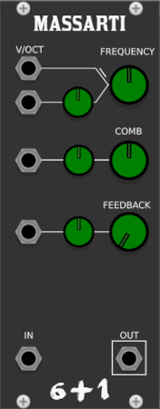

# StudioSixPlusOne
VCV Rack modules

A collection of modules for [VCV Rack](https://github.com/VCVRack/Rack), a cross platform opensource, modular synth emulator software.

Modules are polyphonic where applicable. Early releases and beta modules can be found here on github, before being submitted to the VCV libary.

## Building from code

Instructions can be found in the VCV manual https://vcvrack.com/manual/Building#building-rack-plugins
  
 ## Modules
 
 [Wallenda](#wallenda)
 
 [Maccomo](#maccomo)

 [Massarti](#massarti)
 
 [Tyrant](#tyrant)

 [Zazel](#zazel)
 

  

 ### Wallenda
 
  

 A delay plugin designed for use when using [Karplus–Strong string synthesis](https://en.wikipedia.org/wiki/Karplus%E2%80%93Strong_string_synthesis) featuring:
 
 - Delay time tuned to pitch, via the V/oct input and the two tune knobs, Octave selector and fine tune in semitones
 - Feedback control, focusing on the area required for the string delay
 - Seven voice unison per polyphonic channel
 - Stretch, the nature of strings gives a natural decay, this controls the length
 - Polyphonic, the number of channels is defined by the audio input
 
 The main audio input should be triggered with noise, the color and duration of this has a large impact on the resulting sound. Try experimenting with short bursts, such as snare sounds, longer noise sounds with automated frequency can be used to emulate a bowed sound. All varations of sound input can be used to create sounds. 

 
 
 
 
 

### Maccomo  

 

An emulation of a ladder filter, based on the descriptions and block diagrams in Will Pirkles book "Designing Software Synthesizers Plugins in C++" featuring:

- Six modes, selectable via CV and the knob, allowing for automatiom between lp12, lp24, hp12, hp24, bp12 and bp24
- Frequency contols are summed, for accurate pitch tracking set the knob to C4 261Hz and use the V/oct input
- Resonance that allows for self oscillation
- Drive to add colour and dirt to the sound, works well when self oscillating
- Polyphonic, the number of channels is defined by the audio input or the V/oct input for use as an oscillator

If the audio input is disconnected, the filter will still run in monophonic mode or with the channel count of the V/oct input, allowing for self oscillation and use as a VCO.

 
 
 
 

### Massarti

 

A feedfoward comb filter with added feeback loop, can be used to create pitched sounds from noise, or for the adding of overtones

- Frequency contols are summed, for accurate pitch tracking
- Comb control adjusts the magnitude of the harmonic bands, positive values boost, negative values cut
- Feedback adds warmth, and reverb like effect
- Polyphonic, the number of channels is defined by the audio input

 
 
 
 
 
 
 
 
 
 

### Tyrant

A monophonic in, polyphonic out shift register, with many probability options.

- Variable number of polyphonic channels for 1 - 16
- Trigger Probability controls the chance of triggers being skipped
- Shuffle Probability controls the values in the buffer being reordered
- Three accent controls
- Accent A & B apply a fixed offset, Accent RNG applies a random offset with the maximum value defined by the offset controls
- If Accent CV's have no input or a monophonic input all channels are affected simultaneously, If the probability cv inputs have polyphonic inputs the channels are effected independently
- The Reset input sets the current channel count to 1 and samples the input, the channel count is increased on each trigger input, until the desired channel count is reached

 
 
 

Youtube Tutorial

[YouTubeTutorial](https://www.youtube.com/watch?v=OJSy8fOxI5I)

### Zazel

A performance-based controller, designed to be connected to midi triggers, to allow smooth fades using easing functions between parameters on other modules, pairs well with VCV MIDI-Gate.

- Parameter select widget, display the module and parameter currently controlled, left-click then click on the desired parameter to assign, right-click to unassign
- Curve display. Shows the currently selected easing, and form depending on one-shot or cycle mode
- Easing shape, the full selection of Robert Penner's Easing Functions
- Start value, sets one extreme of the parameter value
- End value, sets the other extreme of the parameter value
- Duration, the time taken to automate the parameter from the start to the end value. see Clock below
- Cycle - Oneshot, when in cycle mode the selected parameter is always translating from start to end value and back. when in Oneshot mode, a positive trigger at the "start" input automates the selected parameter from the start to end value, a negative-going trigger will reverse the automation
-Clock, the clock signal provides the time multiplier used by the duration control, if no input is provided the duration is multiplied by 1 second
- Start, this is the trigger input used in one-shot mode
- Stop-Cont, this is a pause control
- Out CV output reflecting the controlled parameter

